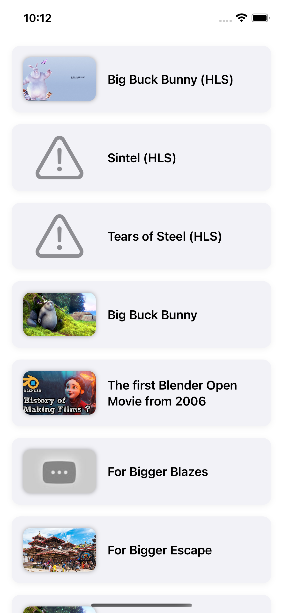
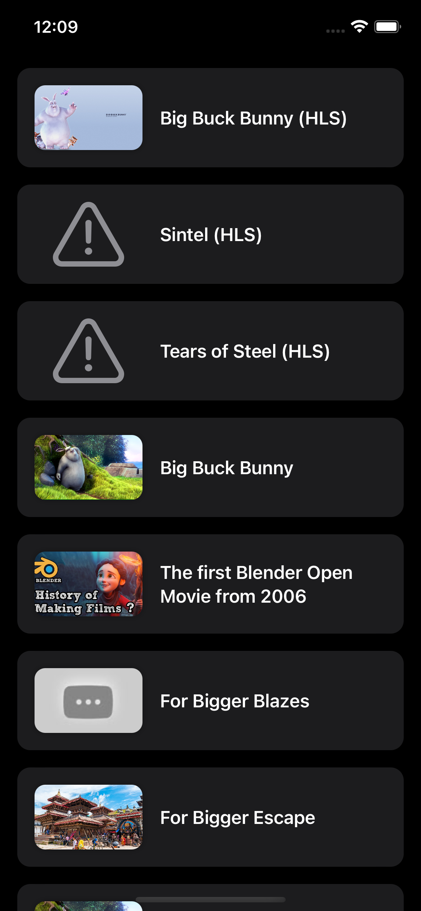
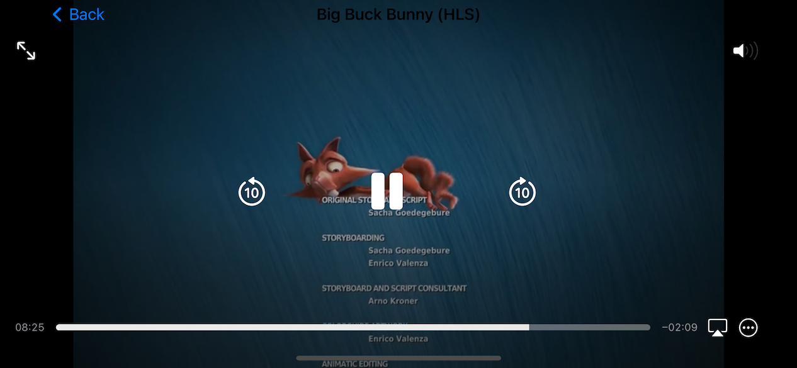

# 🎬 VideoFlix (MVVM + SwiftUI)

A clean, modular, and production-ready video streaming app built using **SwiftUI** and **MVVM architecture**.  
VideoFlix demonstrates how to build scalable iOS apps with best practices like **SOLID principles**, **resume playback**, **offline support**, and **HLS video streaming**.

---

## 🚀 Features

- ✅ Built with **SwiftUI** and **MVVM architecture**
- ✅ Fetch video list from local JSON
- ✅ Stream HLS videos with `AVPlayerViewController`
- ✅ Resume playback from last watched position
- ✅ Video thumbnail loading with `AsyncImage`
- ✅ Clean separation of concerns
- ✅ Lightweight `UserDefaults` persistence
- ✅ Full Dark Mode support
- ✅ Beautiful, polished UI
- ✅ Modular, testable ViewModels

---

## 📸 Screenshots

| Video List (Light Mode) | Video List (Dark Mode) | Player View |
|-------------------------|------------------------|-------------|
|  |  | |

---

## 🧠 SOLID Principles in VideoFlix (MVVM)

| Principle | Description | Example in VideoFlix |
|---------- |-------------|-----------------------|
| **S — Single Responsibility** | Each class/component should have only one job | `VideoListViewModel` handles state, `PlaybackStorageService` handles persistence |
| **O — Open/Closed** | Components should be open to extension, closed to modification | You can swap `VideoService` with a new API without modifying `VideoListViewModel` |
| **L — Liskov Substitution** | Subtypes should be replaceable without breaking functionality | `VideoServiceProtocol` lets you inject real or mock services without changing logic |
| **I — Interface Segregation** | Prefer many small protocols over one large one | `VideoServiceProtocol`, `PlaybackStorageServiceProtocol` keep responsibilities focused |
| **D — Dependency Inversion** | High-level modules shouldn't depend on low-level ones | `ViewModel` depends on abstract `VideoServiceProtocol`, not concrete class |

> ✅ **Result**: VideoFlix is fully testable, decoupled, and easily extendable for new features like downloads or remote APIs.

---

## 🧱 MVVM Architecture

```
VideoFlix
├── Models/
│   └── VideoItem.swift
├── Services/
│   ├── VideoService.swift
│   └── PlaybackStorageService.swift
├── ViewModels/
│   ├── VideoListViewModel.swift
│   └── VideoPlayerViewModel.swift
├── Views/
│   ├── VideoListView.swift
│   ├── VideoPlayerView.swift
│   ├── VideoCardView.swift
│   └── VideoPlayerRepresentable.swift
├── Resources/
│   └── video_list.json
└── Assets.xcassets
```

---

## 📦 Sample `video_list.json`

```json
[
  {
    "id": "1",
    "title": "Big Buck Bunny",
    "thumbnailURL": "https://via.placeholder.com/150",
    "videoURL": "https://test-streams.mux.dev/x36xhzz/x36xhzz.m3u8"
  }
]
```

Place this file in your **main bundle** under `Resources/`.


---

## 🛠 Getting Started

1. Clone the repo:
```bash
git clone https://github.com/shivajipawar/VideoFlix-mvvm.git
```

2. Open the Xcode project:
```bash
open VideoFlix-SwiftUI.xcodeproj
```

3. Run the app on iOS Simulator (iPhone 13+ recommended)

---

## 📄 License

MIT License. Use freely for personal or commercial projects.

---

## 👨‍💻 Author

**Shivaji Pawar**  
📍 Pune, Maharashtra, India  
[GitHub](https://github.com/shivajipawar) | [LinkedIn](https://www.linkedin.com/in/shivaji-pawar-a4323860/)

---

## 🙌 Contributions Welcome

Feel free to fork, suggest improvements, or raise issues.  
See [CONTRIBUTING.md](CONTRIBUTING.md) for contribution guidelines.

---

## ⭐️ Show Your Support

If you found this project helpful, consider giving it a ⭐️ to help others discover it!
